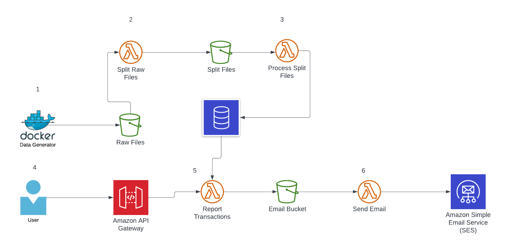

# Processing Transactions
## Architecture

1. A job generating random data send a csv file to a bucket.
2. A lambda take the file from the Raw Files bucket and split into smaller files.
3. Next function take the smaller file and do transformation and validation over the data and write the register into a data base.
4. The user request a report form all the data of the database.
5. The Report transactions lambda function read the data from the database and generate and saved in a bucket.
6. The Send Email function take the last file and email the user using SES server

## Component
 
- [Database implemented using Mysql and AWS RDS](./db/README.md).
- [Lambda functions using SAM CLI and Python](./processingData/README.md)
- [Data Generator using golang and Docker](./dataGenerator/README.md)